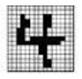
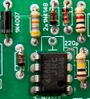
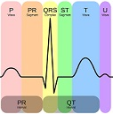
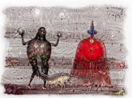

## Course Topics
- [**Pattern Recognition**](https://laboratorypatternrecognition.github.io/PatternRecognition_S/pattern_recognition.html) : Techniques for identifying patterns in data with applications in image, speech, and biometrics.
- [**Machine learning**](https://laboratorypatternrecognition.github.io/MachineLearningS/machine_learning.html): Core algorithms and models for data-driven decision-making and predictive analysis
- [**Circuit analysis**](https://laboratorypatternrecognition.github.io/CircuitElectronics/Introduction_CircuitElectronics.html): Principles of circuit analysis and the operation of electronic components like diodes, transistors, and op-amps
- [**Signal processing**](https://laboratorypatternrecognition.github.io/SignalSystem/SignalSystemStart.html): Techniques for analyzing, filtering, and transforming signals in both time and frequency domains
- [**AI Essentials**](https://laboratorypatternrecognition.github.io/AI-Essentials/Home_Page.html): Fundamentals of artificial intelligence, covering problem-solving, search algorithms, and basic machine learning concepts

